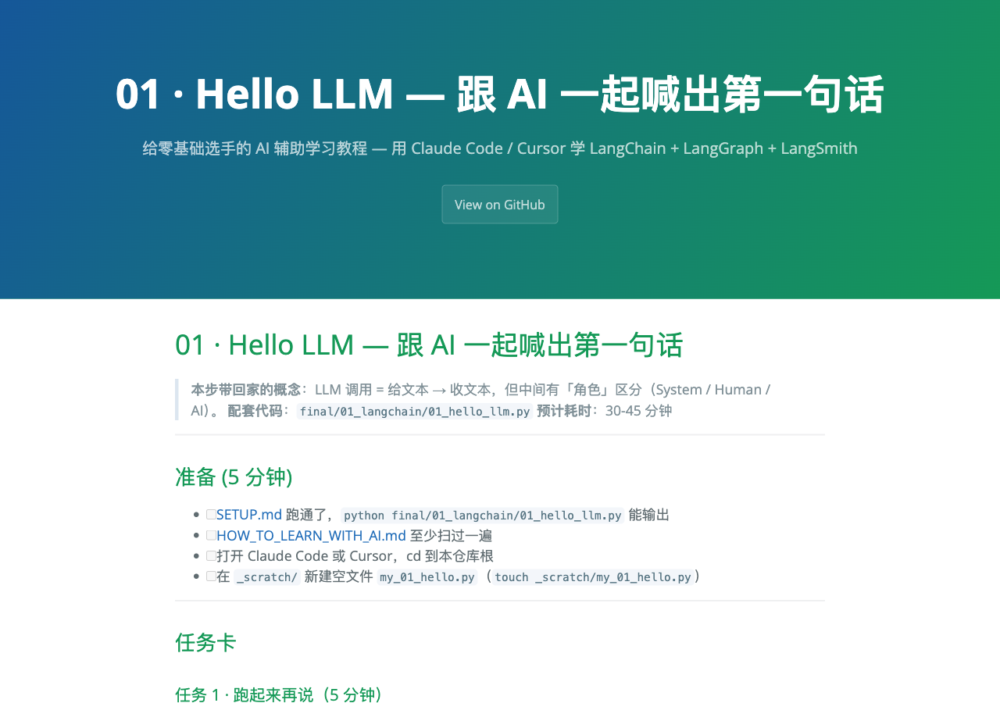

<section class="tutorial-hero" aria-labelledby="tutorial-title">
  <div>
    <div class="tutorial-hero__status">
      <span class="jx-chip" data-state="maintained">持续维护</span>
      <span>Chinese · learning by building · LangChain 1.3.2</span>
    </div>
    <h1 id="tutorial-title">把 AI 从“答案机”，变成你的编程学习搭档。</h1>
    <p class="tutorial-hero__lede">LangChain Tutorial Zero 面向刚接触 AI 应用开发的中文学习者。你不会从复制完整答案开始，而会沿着 16 篇任务卡，在自己的 <code>_scratch/</code> 里动手、对照、解释，再把卡点留下来。</p>
    <p class="tutorial-hero__en" lang="en"><strong>English summary.</strong> A Chinese, beginner-oriented learning system for LangChain, LangGraph, and LangSmith. Sixteen guided lessons pair Socratic AI prompts with hands-on tasks, executable references, self-checks, and a learning journal.</p>
    <div class="tutorial-hero__actions" aria-label="开始学习">
      <a class="jx-action" href="https://estelledc.github.io/langchain-langgraph-langsmith-tutorial/HOW_TO_LEARN_WITH_AI.html">先学会怎么问 AI</a>
      <a class="jx-action jx-action--secondary" href="https://estelledc.github.io/langchain-langgraph-langsmith-tutorial/tutorial/">查看 4 周路径</a>
      <a class="jx-pill" href="https://github.com/estelledc/langchain-langgraph-langsmith-tutorial">GitHub repository</a>
    </div>
  </div>

  <aside class="tutorial-terminal" aria-label="教程学习循环示例">
    <div class="tutorial-terminal__bar">
      <span class="tutorial-terminal__lights" aria-hidden="true"><i></i><i></i><i></i></span>
      <span>learning-session.md</span>
    </div>
    <pre><span class="terminal-prompt">$ goal</span>
理解 StateGraph，不复制完整答案

<span class="terminal-prompt">$ ask-ai</span>
先用“地铁线路图”类比，只问我一个问题

<span class="terminal-pass">✓ build</span>  _scratch/my_graph.py
<span class="terminal-pass">✓ compare</span> final/02_langgraph/01_simple_graph.py
<span class="terminal-pass">✓ explain</span> 为什么条件边决定下一站

<span class="terminal-note">→ journal: 写下卡点与“原来如此”时刻</span></pre>
  </aside>
</section>

<div class="metric-strip" aria-label="教程可核验范围">
  <div><strong data-metric="lessons">16</strong><span>篇学习剧本</span></div>
  <div><strong data-metric="entrypoints">14</strong><span>个直接验证入口</span></div>
  <div><strong data-metric="concepts">18</strong><span>个类比式概念</span></div>
  <div><strong data-metric="challenges">7</strong><span>个开放挑战</span></div>
</div>

<section class="home-section task-lab" id="try-one" aria-labelledby="task-lab-title">
  <div class="home-heading">
    <span class="home-heading__index">Try one task · no timer</span>
    <h2 id="task-lab-title">先完成一个微任务，再决定要不要学四周。</h2>
    <p>这不是装饰性的 demo。它复刻第一课的最小节奏：用类比定位角色、补一处代码、自检，再写下一句能复用的理解。</p>
  </div>
  <div class="task-lab__grid">
    <ol class="task-lab__steps" aria-label="微任务进度">
      <li data-task-stage="analogy" data-state="current" aria-current="step"><span>01</span><strong>类比</strong><small>先建立角色直觉</small></li>
      <li data-task-stage="fill"><span>02</span><strong>补代码</strong><small>只填关键一格</small></li>
      <li data-task-stage="check"><span>03</span><strong>自检</strong><small>解释为什么</small></li>
      <li data-task-stage="journal"><span>04</span><strong>日志</strong><small>留下迁移线索</small></li>
    </ol>
    <div class="task-lab__workbench" data-task-lab>
      <p class="task-lab__analogy"><span>地铁类比</span> Prompt 是目的地说明，模型客户端是把这张说明送进模型、再把回复带回来的列车。</p>
      <fieldset>
        <legend>哪一个名字应该填进模型客户端的位置？</legend>
        <pre aria-label="待补全的 Python 代码"><code>llm = <mark data-code-slot>_____</mark>(
    model="qwen-plus"
)
reply = llm.invoke("用一句话介绍你自己")</code></pre>
        <div class="task-lab__choices">
          <label><input type="radio" name="model-client" value="PromptTemplate"> <span>PromptTemplate</span></label>
          <label><input type="radio" name="model-client" value="ChatOpenAI"> <span>ChatOpenAI</span></label>
          <label><input type="radio" name="model-client" value="LangSmith"> <span>LangSmith</span></label>
        </div>
        <button class="task-lab__check" type="button" data-check-answer disabled>检查我的选择</button>
        <p class="task-lab__status" data-task-status role="status" aria-live="polite">先选择一个答案；这里只检查角色判断，不会调用外部模型。</p>
      </fieldset>
      <div class="task-lab__journal" data-task-journal hidden>
        <span>Journal prompt</span>
        <p>补完这句话：<strong>“模型客户端像列车，但这个类比不适用于 ______，因为 ______。”</strong></p>
        <a href="https://estelledc.github.io/langchain-langgraph-langsmith-tutorial/tutorial/week-1-langchain/01_hello_llm.html">带着这句话进入第一课 →</a>
      </div>
      <noscript><p class="task-lab__noscript">正确答案是 <code>ChatOpenAI</code>。启用 JavaScript 后可以体验选择、自检与日志解锁。</p></noscript>
    </div>
  </div>
</section>

<section class="home-section" id="problem" aria-labelledby="problem-title">
  <div class="home-heading">
    <span class="home-heading__index">01 / Problem</span>
    <h2 id="problem-title">初学者缺的通常不是代码，而是一条不会被 AI 代做的学习路径。</h2>
    <p>官方文档擅长告诉你 API 是什么，却默认你已经理解 Agent、State、Trace 等上下文；聊天机器人又很容易直接交付一段完整代码，让“能运行”掩盖“没理解”。</p>
  </div>
  <div class="problem-grid">
    <article class="problem-card">
      <span class="card-kicker">Context gap</span>
      <h3>术语先于直觉出现</h3>
      <p>第一次看到 LCEL、ReAct 或 Checkpointer 时，定义本身并不能告诉你它为什么存在。</p>
    </article>
    <article class="problem-card">
      <span class="card-kicker">Copy trap</span>
      <h3>AI 太快给出完整答案</h3>
      <p>复制代码能让终端变绿，却没有暴露自己的心智模型，也没有留下可迁移的判断。</p>
    </article>
    <article class="problem-card">
      <span class="card-kicker">Version drift</span>
      <h3>框架更新让示例失效</h3>
      <p>LangChain 1.x 的拆包和 API 变化会让旧教程报错，必须把依赖版本、修复和运行记录放在一起。</p>
    </article>
  </div>
</section>

<section class="home-section" id="learning-system" aria-labelledby="system-title">
  <div class="home-heading">
    <span class="home-heading__index">02 / Learning system</span>
    <h2 id="system-title">每一课都走同一条闭环：先建立直觉，再亲手证明。</h2>
    <p>教程把 AI 放在“陪练”位置。它可以换类比、拆小问题、提供候选根因，但关键代码、差异判断和学习日志由学习者完成。</p>
  </div>
  <div class="learning-loop" aria-label="四步学习闭环">
    <div>
      <span class="card-kicker">01 · Frame</span>
      <strong>类比与大纲</strong>
      <p>先说清概念在解决什么问题，再把实现拆成 3–5 个可回答的小步骤。</p>
    </div>
    <div>
      <span class="card-kicker">02 · Build</span>
      <strong>在 scratch 动手</strong>
      <p>自己的代码只写进 <code>_scratch/</code>；任务卡提供约束，不直接交付完整答案。</p>
    </div>
    <div>
      <span class="card-kicker">03 · Compare</span>
      <strong>区分真错与风格</strong>
      <p>对照 <code>final/</code> 时先判断差异是否影响结果，再由学习者自己修正。</p>
    </div>
    <div>
      <span class="card-kicker">04 · Reuse</span>
      <strong>记录卡点</strong>
      <p>把“原来如此”、有效 prompt 和未解决问题写入 journal，变成下一次可复用的经验。</p>
    </div>
  </div>
</section>

<section class="home-section" id="curriculum" aria-labelledby="curriculum-title">
  <div class="home-heading">
    <span class="home-heading__index">03 / Curriculum</span>
    <h2 id="curriculum-title">4 周、16 篇，从第一次调用走到可评估的 Agent。</h2>
    <p>“周”是内容分组，不是完成承诺。每篇的分钟数是仓库中的学习节奏估算，真实耗时取决于 Python 基础、网络和 API 权限。</p>
  </div>
  <div class="week-grid">
    <a class="week-card" href="https://estelledc.github.io/langchain-langgraph-langsmith-tutorial/tutorial/week-1-langchain/">
      <span class="card-kicker">Week 01</span>
      <h3>LangChain 核心</h3>
      <p>LLM 调用、Prompt、LCEL、Memory 与基础 RAG。</p>
      <span class="week-card__meta">5 lessons · foundations</span>
    </a>
    <a class="week-card" href="https://estelledc.github.io/langchain-langgraph-langsmith-tutorial/tutorial/week-2-tools-and-agent/">
      <span class="card-kicker">Week 02</span>
      <h3>Tool 与工程化</h3>
      <p>工具调用、结构化输出、流式响应、重试与 fallback。</p>
      <span class="week-card__meta">3 lessons · reliability</span>
    </a>
    <a class="week-card" href="https://estelledc.github.io/langchain-langgraph-langsmith-tutorial/tutorial/week-3-langgraph/">
      <span class="card-kicker">Week 03</span>
      <h3>LangGraph</h3>
      <p>StateGraph、条件边、Human-in-the-loop 与多 Agent。</p>
      <span class="week-card__meta">4 lessons · orchestration</span>
    </a>
    <a class="week-card" href="https://estelledc.github.io/langchain-langgraph-langsmith-tutorial/tutorial/week-4-langsmith-and-project/">
      <span class="card-kicker">Week 04</span>
      <h3>LangSmith + Capstone</h3>
      <p>Tracing、Evaluation、Dataset 与四文件研究助手。</p>
      <span class="week-card__meta">4 lessons · evaluation</span>
    </a>
  </div>
</section>

<section class="home-section" id="evidence" aria-labelledby="evidence-title">
  <div class="home-heading">
    <span class="home-heading__index">04 / Evidence</span>
    <h2 id="evidence-title">把“教程能不能运行”拆成可追溯的证据，而不是一句保证。</h2>
    <p>公开证据区分当前静态检查与 2026-05-29 的历史 API 实测；需要外部凭证的行为不会被本站构建冒充为已重新验证。</p>
  </div>
  <div class="verification-passport" aria-label="验证护照">
    <header><div><span>Verification passport</span><strong>不同证据，不混写成一次“全部通过”。</strong></div><time datetime="2026-07-11">2026-07-11</time></header>
    <ul>
      <li><span class="jx-source-tag" data-source="build">Build</span><div><strong>当前静态契约 · Verified</strong><small>课程数量、页面结构、链接、Python 语法与发布门禁在本轮重新检查。</small></div></li>
      <li><span class="jx-source-tag" data-source="history">History</span><div><strong>外部 API 跑批 · Observed 2026-05-29</strong><small>14 个入口的历史结果为 12 PASS / 1 PARTIAL / 1 SKIP，保留环境与凭证限制。</small></div></li>
      <li><span class="jx-source-tag" data-source="external">External</span><div><strong>当前模型服务状态 · Unknown</strong><small>未在 Pages 构建中重新调用收费 API，因此不声称今天仍全部可运行。</small></div></li>
    </ul>
  </div>
  <div class="evidence-grid">
    <article class="evidence-card evidence-card--primary">
      <span class="card-kicker">Historical run · 2026-05-29</span>
      <h3>14 个入口：12 PASS / 1 PARTIAL / 1 SKIP</h3>
      <p>历史记录逐项列出耗时、输出与限制。PARTIAL 来自本机 SSL 环境，SKIP 来自 embedding 权限；本次前端重构没有把它们重新宣称为通过。</p>
      <a href="https://estelledc.github.io/langchain-langgraph-langsmith-tutorial/docs/test-runs.html">查看真实运行记录</a>
    </article>
    <article class="evidence-card">
      <span class="card-kicker">Compatibility</span>
      <h3>依赖被固定，6 处破坏性变更有记录</h3>
      <p><code>requirements.txt</code> 固定 LangChain 1.3.2、LangGraph 1.2.2 与 LangSmith 0.8.7；迁移原因保留在测试档案。</p>
      <a href="https://github.com/estelledc/langchain-langgraph-langsmith-tutorial/blob/master/requirements.txt">查看依赖口径</a>
    </article>
    <article class="evidence-card">
      <span class="card-kicker">Executable contract</span>
      <h3>展示、链接与 Python 语法进入发布门禁</h3>
      <p>Pages 发布前会核对课程数量、元数据、唯一 H1、内部链接，并对全部参考 Python 文件执行语法编译检查。</p>
      <span class="evidence-card__note">CI · source + rendered output</span>
    </article>
  </div>
</section>

<section class="home-section lesson-proof" aria-labelledby="lesson-title">
  <div>
    <span class="home-heading__index">Inside one lesson</span>
    <h2 id="lesson-title">教程页不是 API 清单，而是一组能亲手完成的任务卡。</h2>
    <ol class="lesson-proof__steps">
      <li>先跑参考，描述自己观察到的输入与输出。</li>
      <li>挖空关键步骤，在 <code>_scratch/</code> 写自己的版本。</li>
      <li>故意制造一个错误，再解释它暴露的机制。</li>
      <li>对照 final，自检并写下卡点日志。</li>
    </ol>
    <p><a href="https://estelledc.github.io/langchain-langgraph-langsmith-tutorial/tutorial/week-1-langchain/01_hello_llm.html">打开第一篇任务卡</a></p>
  </div>
  <figure class="lesson-proof__visual">
    
  </figure>
</section>

<section class="home-section builder-section" id="role" aria-labelledby="role-title">
  <div>
    <span class="home-heading__index">05 / Role & AI boundary</span>
    <h2 id="role-title">以学习者身份构建教程，也对验证边界负责。</h2>
  </div>
  <div>
    <p>我是 Jason Xun。这个项目的角色不是“权威讲师”，而是学生作者、教学系统设计者和维护者：把自己遇到的版本坑、失败路径与有效提问整理成下一位初学者可以复用的脚手架。</p>
    <div class="builder-boundary">
      <div>
        <h3>Human owns</h3>
        <p>课程顺序、学习约束、运行验证、失败分类、内容取舍与最终发布。</p>
      </div>
      <div>
        <h3>AI assists</h3>
        <p>类比生成、问题拆解、代码陪练、候选根因与文档初稿；不代替学习者完成判断。</p>
      </div>
    </div>
    <div class="builder-links">
      <a class="jx-action jx-action--secondary" href="https://estelledc.github.io/about/">About</a>
      <a class="jx-action jx-action--secondary" href="https://estelledc.github.io/resume/">Resume</a>
      <a class="jx-pill" href="https://github.com/estelledc">GitHub</a>
    </div>
  </div>
</section>

<section class="home-section start-panel" aria-labelledby="start-title">
  <h2 id="start-title">第一次打开，从这三步开始。</h2>
  <div class="start-grid">
    <div>
      <strong>01 · Learn the method</strong>
      <p>先读 <a href="https://estelledc.github.io/langchain-langgraph-langsmith-tutorial/HOW_TO_LEARN_WITH_AI.html">HOW_TO_LEARN_WITH_AI.md</a>，理解为什么不直接向 AI 要完整代码。</p>
    </div>
    <div>
      <strong>02 · Prepare locally</strong>
      <p>按 <a href="https://estelledc.github.io/langchain-langgraph-langsmith-tutorial/SETUP.html">SETUP.md</a> 建立虚拟环境与本地 <code>.env</code>；真实 API Key 不进入仓库。</p>
    </div>
    <div>
      <strong>03 · Build lesson one</strong>
      <p>从 <a href="https://estelledc.github.io/langchain-langgraph-langsmith-tutorial/tutorial/week-1-langchain/01_hello_llm.html">01_hello_llm.md</a> 开始，把自己的实现写进 <code>_scratch/</code>。</p>
    </div>
  </div>
</section>

<section class="home-section limits-panel" id="limitations" aria-labelledby="limits-title">
  <h2 id="limits-title">局限与适用边界</h2>
  <div class="limits-grid">
    <div>
      <span class="card-kicker">Prerequisite</span>
      <p>面向框架初学者，不代替 Python 基础；至少应能阅读函数、列表、字典与异常信息。</p>
    </div>
    <div>
      <span class="card-kicker">Version</span>
      <p>示例固定在仓库声明的 1.x 版本，不承诺跟随 LangChain 最新 API；升级需要重新跑批。</p>
    </div>
    <div>
      <span class="card-kicker">External systems</span>
      <p>完整运行依赖 DashScope、LangSmith、网络与模型权限；API 费用、延迟和可用性不由本仓库控制。</p>
    </div>
  </div>
</section>

## 本地验证

站点展示契约、内部链接和 Python 语法检查均可在不提供 API Key 的情况下运行：

```bash
bundle install
JEKYLL_ENV=production bundle exec jekyll build
ruby scripts/check-showcase.rb --built _site
bundle exec htmlproofer _site --disable-external --no-enforce-https \
  --swap-urls '^/langchain-langgraph-langsmith-tutorial:'
python3 -m compileall -q final
bash -n scripts/smoke-test.sh
```

需要模型与 LangSmith 凭证的 14 个入口由 `bash scripts/smoke-test.sh` 执行。它会调用外部服务、产生时延或费用，因此不属于 Pages 构建；运行前请先按 [SETUP.md](SETUP.md) 配置本地 `.env`。历史结果见 [docs/test-runs.md](docs/test-runs.md)。

## 贡献

- 教程卡点：提交 Issue，说明在哪一步、预期什么、实际发生什么。
- 新的兼容性错误：补充 [debug recipes](docs/debug-recipes.md) 与复现条件。
- 真正有效的学习 prompt：补充 [prompt cheatsheet](docs/prompts-cheatsheet.md)。
- 完成 4 周后：从 [7 个开放挑战](docs/challenges.md) 里选一个继续构建。

本项目使用 [MIT License](https://github.com/estelledc/langchain-langgraph-langsmith-tutorial/blob/master/LICENSE)。
