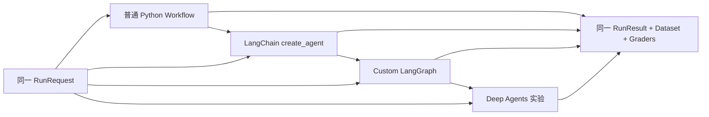

# Agent Engineering Lab

> 从最小 Workflow 到可验证、可恢复、可演进的 Agent 系统。

这个仓库不再按 LangChain API 排课。V2 先建立稳定合同，再比较 Workflow、LangChain Agent、LangGraph 和 Deep Agents 的复杂度是否真的换来收益。

默认路径完全离线，不需要 API Key：

```bash
git clone https://github.com/estelledc/langchain-langgraph-langsmith-tutorial.git
cd langchain-langgraph-langsmith-tutorial
uv sync --frozen
uv run agent-lab run --goal "LangGraph 的 checkpointer 和 Store 有什么区别？"
uv run agent-lab eval --suite fast
```

当前可执行合同：

| 维度 | V2 口径 |
|---|---|
| 课程 | 15 个核心实验 + 10 个前沿实验；状态由元数据生成 |
| 离线实现 | Deterministic Workflow + Typed LangGraph |
| 模型实现 | LangChain `create_agent` 适配器；模型与 provider 显式注入 |
| 数据集 | capability、regression、adversarial、tool contracts 分层 |
| 评测 | Final、Attribution、Step、Trajectory、Policy 确定性 grader |
| 状态 | `PASS / FAIL / UNKNOWN / ERROR`，后两者不生成质量分 |
| 发布 | fresh install、lint、type、tests、eval、curriculum、site 全部先过门禁 |

## 先纠正一个常见前提

“用了更前沿的 Agent 框架”不等于“系统更好”。这里先做普通程序基线，再逐层增加自治能力：



只有在同一数据集上改善成功率、恢复能力、成本或上下文隔离时，额外复杂度才有理由保留。

## 稳定核心

领域合同不依赖具体模型提供商：

```text
RunRequest
  ├── goal / constraints / allowed_capabilities
  └── Budget(model, tool, step, time, evidence)
        ↓
deterministic policy shell
        ↓
Workflow / LangChain / LangGraph / Deep Agents
        ↓
RunResult
  ├── status / termination_reason
  ├── Evidence / Citation / Artifact
  ├── ToolCallRecord / TraceEvent / Metrics
  └── AgentError
```

关键边界：

- 搜索 fixture 明确标记为 `fixture`，不会冒充实时互联网。
- 模型可控表达式不会进入 `eval()`、`exec()` 或宿主 shell。
- Runtime context、thread state 和 cross-thread memory 分开。
- Checkpointer 由 runtime 注入；相同 `thread_id` 本身不保证可续接。
- 工具失败、Agent 失败和 grader 失败分别记录。
- Trace 记录动作与状态，不记录隐藏推理。

## Trusted Research 纵向切片

V2 的第一个真实闭环：

```text
请求
→ 权限与预算
→ Fixture Retrieval
→ Evidence Validation
→ 引用式答案
→ Citation Check
→ Final / Step / Trajectory / Policy Eval
→ Verification Passport
```

fast suite 当前包含 9 个 case，分别跑 Workflow 和 LangGraph，共 18 个确定性 case-run。它会主动覆盖：

- 有证据时完成并引用。
- 无证据时拒答为 `unknown`。
- 提示注入 fixture 被隔离。
- 权限缺失和 capability 未授权时不调用工具。
- 工具预算为零时在执行前停止。
- grader 异常不会折算成中间分。

[查看完整实验路径](labs/) · [查看架构](docs/architecture.md) · [查看验证口径](docs/verification.md)

## 学习闭环

每个实验都走同一条八步链路：

```text
Frame → Predict → Build → Break → Trace → Evaluate → Reflect → Promote
```

`Promote` 不是多写一页笔记，而是把已观察失败升级为 regression case、policy、test 或版本化程序性知识。

## 证据边界

当前默认门禁能证明：

- 锁文件可解析并安装。
- 离线 Workflow 和 LangGraph 满足同一合同。
- 安全计算器拒绝名称、调用、属性访问和超限指数。
- fast regression suite 的严格阈值可执行。
- 课程导航和页面由同一元数据生成。

它不能证明：

- 任一付费模型今天可用或质量稳定。
- LangSmith online evaluation 已接入真实流量。
- Agent Server 已部署到生产环境。
- fixture 结论是刚刚联网核验的最新事实。

这些结果只有在对应 live run 或 deployment receipt 存在时才升级状态。

## V1 历史

原来的 4 周、16 篇 LangChain Tutorial Zero 没有被悄悄改写。它冻结在 [`v1-legacy`](https://github.com/estelledc/langchain-langgraph-langsmith-tutorial/tree/v1-legacy)，V2 源码中也保留在 `legacy/v1/` 供迁移审计。

## 常用入口

```bash
make sync        # uv sync --frozen
make test        # pytest + coverage
make eval        # 18 个离线 case-run
make verify      # 本地完整离线门禁
make site        # Jekyll 渲染
```

- [安装与可选依赖](SETUP.md)
- [25 个实验](labs/)
- [RFC 0001：产品范围](docs/rfcs/0001-product-scope.md)
- [ADR 索引与架构](docs/architecture.md)
- [验证、发布和 UNKNOWN](docs/verification.md)
- [兼容性矩阵](docs/compatibility.md)
- [贡献指南](CONTRIBUTING.md)
