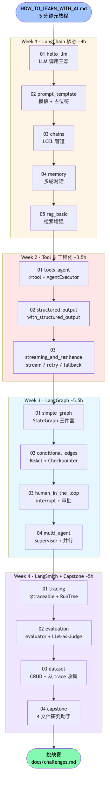
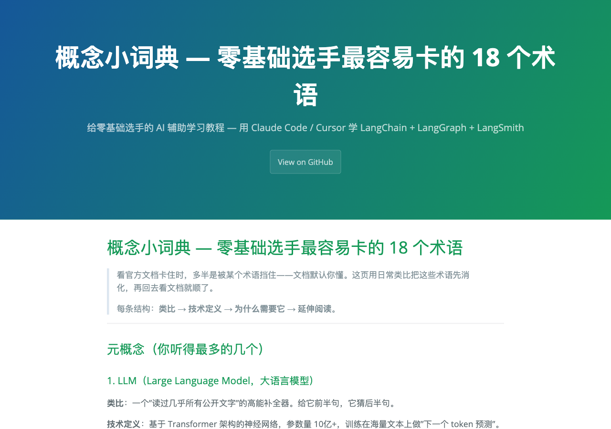

# LangChain Tutorial Zero

> 给编程零基础选手的 LangChain 1.3.x 中文教程，4 周 14 篇 learning-by-doing。

零基础学习者打开这个仓库学 LangChain，三条线按"什么算做完了"来组织：

- **AI 辅助学习元教程** —— 做完的标志是你能独立用 Claude Code 上手下一个新框架。[HOW_TO_LEARN_WITH_AI.md](HOW_TO_LEARN_WITH_AI.md) 给出 7 条 prompt 原则，每篇配任务卡，[CLAUDE.md](CLAUDE.md) 把教学约束注入 AI（不用类比 / 不一口气讲 5 个概念 / 报错先问"你以为会发生什么"）。
- **LangChain 1.3.x 实测** —— 做完的标志是 14 个 final 脚本在 1.3.x 上一次跑通。[docs/test-runs.md](docs/test-runs.md) 记录了 6 处破坏性变更的修法（`pydantic_v1` 迁移、`langchain_classic` 拆包、`LangChainStringEvaluator` 等）。
- **任务卡 + 给 AI 的 prompt** —— 完成态是你在 `_scratch/` 写出自己的版本，再对照 `final/` 找差距。每篇提供一组任务卡和可复制的 prompt 模板，按 learning-by-doing 推进。

**在线版**：[estelledc.github.io/langchain-langgraph-langsmith-tutorial](https://estelledc.github.io/langchain-langgraph-langsmith-tutorial/) — 不想 clone 也能直接读

## 4 周学习路径（约 17 小时）

<p align="center">
  
</p>

每周一段，从 LangChain 核心 → Tool/Agent → LangGraph → LangSmith。每篇时长见 [tutorial/README.md](tutorial/README.md)。

---

## 关于作者

我是 jason，编程零基础。这套教程的产生方式很简单：开一个空仓库，跟 Claude Code 一句一句问，把 LangChain / LangGraph / LangSmith 啃下来——每跑通一个最小例子，就把过程里卡住的地方（pydantic 版本错 / DashScope 兼容性 / `langchain_classic` 拆包……）原样落进 [docs/debug-recipes.md](docs/debug-recipes.md) 和 [docs/test-runs.md](docs/test-runs.md)。

判断"学懂了"的标准也对应这个动作：例子能从零跑通、报错能自己定位、踩过的坑下次不再踩。这套教程留下的是卡点的位置和当时管用的 prompt——下一个零基础的人照着走，可以少绕一段。

如果你也是零基础，建议先读 [HOW_TO_LEARN_WITH_AI.md](HOW_TO_LEARN_WITH_AI.md)，它讲的是怎么跟 AI 配合学，零基础起步用得上。

---

## 60 秒 Quick Start

不用 clone 仓库，三步跑通第一个 LangChain + DashScope 调用。

**1. 装包**

```bash
pip install langchain langchain-openai python-dotenv
```

**2. 设环境变量**

去 [DashScope 控制台](https://dashscope.console.aliyun.com/) 申请 API Key（有免费额度），然后：

```bash
export DASHSCOPE_API_KEY="sk-你的key"
export DASHSCOPE_BASE_URL="https://dashscope.aliyuncs.com/compatible-mode/v1"
```

**3. 跑第一个 LLM 调用**

新建 `hello.py`：

```python
from langchain_core.messages import HumanMessage, SystemMessage
from langchain_openai import ChatOpenAI
import os

llm = ChatOpenAI(
    model="qwen-plus",
    base_url=os.environ["DASHSCOPE_BASE_URL"],
    api_key=os.environ["DASHSCOPE_API_KEY"],
    temperature=0.7,
)

messages = [
    SystemMessage(content="你是一个简洁的 AI 助手，回答不超过 50 字。"),
    HumanMessage(content="什么是 LangChain？"),
]

response = llm.invoke(messages)
print(response.content)
print("Token 用量：", response.response_metadata.get("token_usage", {}))
```

```bash
python hello.py
```

跑通了？正式从 [tutorial/week-1-langchain/01_hello_llm.md](tutorial/week-1-langchain/01_hello_llm.md) 开始。跑不通？查 [docs/debug-recipes.md](docs/debug-recipes.md)。

---

## 完整环境（4 周教程）

Quick Start 只是单文件 demo。要走 4 周 14 篇完整教程：

```bash
# 1. fork 本仓库，clone（YOUR-USERNAME 换成你自己）
git clone https://github.com/YOUR-USERNAME/langchain-langgraph-langsmith-tutorial.git
cd langchain-langgraph-langsmith-tutorial

# 2. 跟着 SETUP.md 配 .env 和依赖（约 15 分钟，含申 API Key）
open SETUP.md

# 3. 读完元教程再开始（5 分钟，必读）
open HOW_TO_LEARN_WITH_AI.md

# 4. 走第一篇 tutorial
open tutorial/week-1-langchain/01_hello_llm.md
```

> **仓库 vs 项目代号**：仓库名 `langchain-langgraph-langsmith-tutorial` 是历史名；项目代号叫 **LangChain Tutorial Zero**——git clone 命令以仓库名为准。

---

## 一眼看懂教程结构

学习者打开任意一篇 tutorial，看到的是**任务卡 + 给 AI 的 prompt** 结构（不是 reference style 的 API 罗列）：


撞到不懂的术语？打开 [docs/concepts.md](docs/concepts.md)，每个术语**先类比再定义**：



---

## VS 官方教程

| 维度 | LangChain 官方文档 | 这套教程 |
|---|---|---|
| **目标读者** | 已懂 LLM / Agent 概念的工程师 | 编程零基础（能看懂 `def foo():` 即可） |
| **教学风格** | reference style — 直给代码 + API 文档 | learning-by-doing — 任务卡 + 自己写 + 自检 |
| **AI 工具维度** | 完全没有 | 每个知识点配「给 AI 的 prompt」让 CC/Cursor 陪你拆代码 |
| **术语处理** | 默认你懂（"embedding"/"agent"/"trace" 直接用） | [docs/concepts.md](docs/concepts.md) 18 个核心术语全用日常类比 |
| **错误处理** | 散落各处，要自己搜 | [docs/debug-recipes.md](docs/debug-recipes.md) 16 个高频报错速查 |
| **prompt 工程** | 几个固定示例 | [docs/prompts-cheatsheet.md](docs/prompts-cheatsheet.md) 21 个高频 prompt 模板 + 反模式表 |
| **语言** | 主英文，中文翻译滞后 | 原生中文，术语首次出现注英文 |
| **进阶练习** | 无 | [docs/challenges.md](docs/challenges.md) 7 个真实小项目挑战 |
| **典型用法** | "这个 API 怎么调" 时翻文档查一下 | "我要从零学会"——4 周 14 篇按节奏走 |

你翻官方教程查 API 时，这份在旁边讲给你听。

---

## 这是什么

- 4 周从零学会 LangChain + LangGraph + LangSmith
- **核心方法**：每个知识点配「给 AI 的 prompt」+ 自检任务，让 AI 陪你拆代码
- **后端**：DashScope（通义千问）+ LangSmith Trace（都有免费层）

---

## 仓库结构

```
├── HOW_TO_LEARN_WITH_AI.md      # 必读：怎么用 CC/Cursor 学陌生代码
├── SETUP.md                     # 必读：环境搭建
├── tutorial/                    # 学习剧本（你主要看这里）
│   ├── README.md                # 学习路线索引
│   └── week-1-langchain/  ...   # 按周组织，4 周共 14 篇
├── final/                       # 参考答案（任务卡指明何时偷看）
│   ├── _common.py               # 共享 boilerplate（学习者别改）
│   └── 01_langchain/  ...       # 14 个独立可执行 .py
├── docs/                        # 速查 + 进阶资源
│   ├── concepts.md              # 18 个核心术语小词典
│   ├── prompts-cheatsheet.md    # 21 个高频 prompt 模板
│   ├── debug-recipes.md         # 16 个高频报错速查
│   ├── challenges.md            # capstone 后 7 个真实挑战
│   └── test-runs.md             # 14 个 final 实测档案
└── _scratch/                    # 你的主战场（你写的代码放这；已 gitignore）
    └── journal/                 # 卡点日志
```

---

## 适合你吗

适合：周六下午打开 VS Code，跟着第一章跑 `pip install langchain`，报错时把整段堆栈贴给 AI 问"这是什么意思"——如果这个画面对你来说不别扭，这套就合适。

- 编程零基础或只懂语法
- 第一次碰 LangChain
- 想用 AI 工具学陌生代码
- 中文学习者
- 有 30+ 小时（4 周）

不适合：你打开教程，第一反应是想看完整 API 列表，或者想把它当英文文档的中译本——那这套帮不上忙。

- 想找官方文档替代品（请去 [docs.langchain.com](https://docs.langchain.com)）
- 不想写代码只想读
- 英文资料够你看

---

## 学习路线

| 周次 | 内容 | 完成标准 |
|---|---|---|
| **Week 1** | LangChain 核心：LLM、Prompt、LCEL、Memory、RAG | 5 篇笔记已发布 |
| **Week 2** | Tool & Agent、结构化输出、流式与容错 | 3 篇笔记已发布 |
| **Week 3** | LangGraph：StateGraph、条件边、HITL、多 Agent | 4 篇笔记已发布 |
| **Week 4** | LangSmith + Capstone：Tracing、Evaluation、Dataset、综合项目 | 4 篇笔记已发布 |

每篇 tutorial 结构统一：**准备 → 任务卡（4-5 个） → 通关条件 → 卡点日志 → 通往下一站**。

通关后建议：

1. 跑完 capstone → 挑一个 [challenges.md](docs/challenges.md) 做出师作业
2. 你自己沉淀的 prompt → 提 PR 到 [prompts-cheatsheet.md](docs/prompts-cheatsheet.md)
3. 你撞到的新报错 → 提 PR 到 [debug-recipes.md](docs/debug-recipes.md)

---

## 这个仓库**不**做什么

- 不是另一份官方文档翻译——你已经能看英文文档了，本仓库帮不上忙
- 不教 Python 基础——请先看 [Python 基础教程](https://www.runoob.com/python3/python3-tutorial.html) 至少能写循环和函数
- 不保证最新版 LangChain 兼容——pin 在 1.3.x，半年回头一次

---

## 反馈与贡献

提 Issue 或 PR 都行：

- 撞了报错 → PR 到 `debug-recipes.md`
- 觉得某 tutorial 卡点 → 提 issue 描述哪一段不顺
- 用过的 prompt 真有效 → PR 到 `prompts-cheatsheet.md`
- 完成挑战 → PR 你的卡点日志到 `_scratch/journal/challenge-N-<日期>.md`

本项目基于 [MIT License](LICENSE)。

---

> 打开任意一节，把里面的 prompt 复制给 AI 直接问——"该怎么问"的那部分，教程已经替你写好了。
