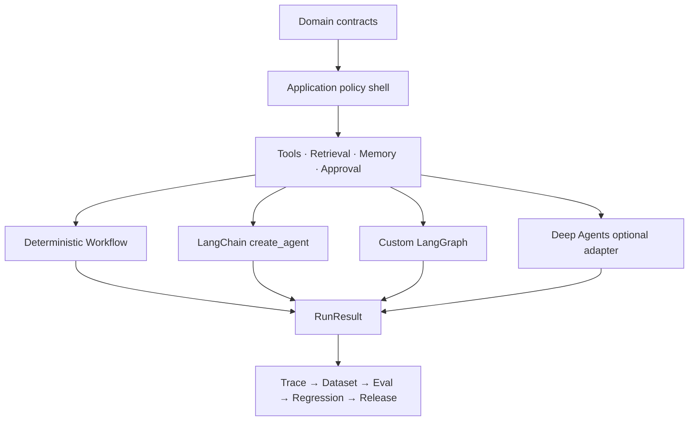

# Architecture

## 依赖方向



依赖只允许向稳定核心收敛：

```text
domain ← application ← capabilities ← runtimes / adapters
```

`domain` 不 import LangChain、LangGraph、LangSmith、Deep Agents 或 provider。

## 确定性外壳，概率性内核

代码负责：

- schema、权限、租户与 capability 白名单。
- 工具副作用、幂等、重试和超时。
- 模型、工具、步骤与成本预算。
- Evidence 和 Citation 完整性。
- 状态转换和发布门禁。

模型负责：

- 模糊意图理解。
- 开放式规划与工具选择。
- 证据综合和自然语言表达。

如果一项规则能由代码确定，就不交给模型猜。

## Context 与 Memory

| 数据 | 生命周期 | 位置 |
|---|---|---|
| user、tenant、permission、client、secret | 单次调用 | `RunContext` |
| 当前任务、临时证据、中断点 | thread | LangGraph state + checkpointer |
| 稳定偏好和事实 | 跨 thread | Memory Store |
| 失败或成功执行摘要 | 跨 thread | Episodic memory |
| policy、prompt、skill、workflow | 版本化 | Procedural memory |

Runtime context 不序列化。长期记忆默认需要审批、namespace、来源和版本。

## Runtime 选择

| 条件 | 首选 |
|---|---|
| 完全确定、步骤固定 | 普通 Workflow |
| 标准模型工具循环 | LangChain `create_agent` |
| 显式状态、分支、恢复、HITL | LangGraph |
| 长任务、文件系统上下文、可测 subagent 收益 | Deep Agents 实验 |

“更高级”不是选择标准；同一 `RunRequest` 在同一 dataset 上的结果才是。

## 关键 ADR

- [框架边界](adrs/0001-framework-boundaries.md)
- [领域合同](adrs/0002-domain-contracts.md)
- [评测语义](adrs/0003-evaluation-semantics.md)
- [记忆模型](adrs/0004-memory-model.md)
- [工具安全](adrs/0005-tool-security.md)
- [Provider 策略](adrs/0006-provider-strategy.md)
