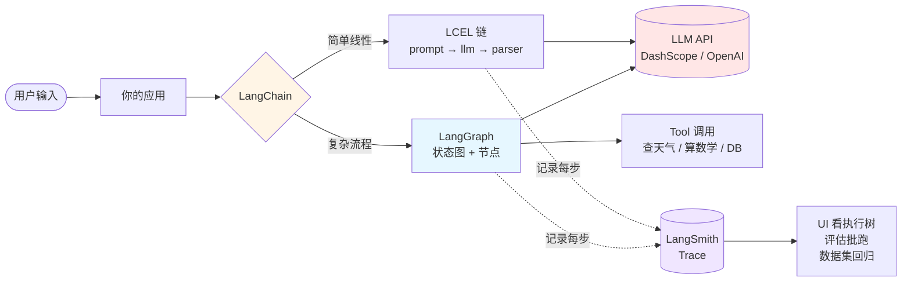

# 00 · Big Picture — 10 分钟看懂 LangChain 生态

> 走 14 篇 tutorial 之前先来这页。**不教你写代码，给你"地图"**——4 周走完时不会迷路。
>
> **这篇官方教程里没有**——他们一上来就 quickstart。零基础最缺的不是怎么调 API，是"这套东西到底解决了什么"。

---

## 一句话讲清

> **LangChain** = 一组让 LLM 应用好搭的"乐高积木"
> **LangGraph** = 当流程复杂（循环 / 分支 / 暂停）时，把积木拼图变成"流程图"
> **LangSmith** = 给上面两个产物装"黑匣子"——上线后可观测、可评估

三个东西**不是**层级关系，是**协作关系**——你做项目大概率三个都用。

---

## 一张图看全景

**箭头方向**：

- 实线 = 数据流（你的请求会真的"跑"过去）
- 虚线 = 旁路记录（LangSmith 不打断主流程，只在旁边录像）

---

## 5 段拆解（每段 ≤ 100 字）

### 1. LLM 是什么——你的乐高的"原始砖"

LLM（GPT / Claude / 通义千问）= 一个"读过几乎所有公开文字"的高能补全器。给前半句猜后半句。本质就一个 HTTP API，你 POST `{"messages": [...]}`，它回 `{"content": "..."}`。

**单纯调用 LLM 你不需要 LangChain**——直接 `requests.post()` 也行。LangChain 出现是为了**重复使用的工程化**。

### 2. LangChain 解决的真问题——重复代码太多

写 LLM 应用你会发现 5 件事每个项目都要做：

1. 拼 prompt（变量填空）
2. 调 LLM（统一接口，今天 DashScope 明天 OpenAI 都能换）
3. 解析回答（从 JSON / 文本 / 结构化对象）
4. 串多步（先翻译再总结）
5. 加历史（多轮对话记住上文）

LangChain 把这 5 件事抽成 `PromptTemplate` / `ChatModel` / `OutputParser` / `LCEL 管道` / `Memory`，**用 `|` 串起来一行写完**。

### 3. LangGraph 出现的时机——LCEL 不够用

LCEL 链是**线性 + 静态**——`A | B | C` 写死了。但真实 Agent 要：

- **循环**："调一次工具 → 看结果 → 再调"（不知道几次）
- **分支**："如果意图是 X 走 A，否则走 B"
- **HITL**：暂停等用户审批，再继续

写 if/while 也能做，但很快变面条代码。**LangGraph 用"状态图"统一这些场景**——节点是函数、边是路由、State 是共享数据字典。可视化 + 可暂停 + 可恢复。

### 4. RAG 是 LangChain 用得最多的"组合招式"

RAG（检索增强生成）= 4 步开卷考试：

1. **切片**：把私有文档切 500 字小块
2. **向量化**：每块算 embedding 存向量库
3. **检索**：用户问问题 → 找语义最近的几块
4. **增强生成**：把找到的块拼到 prompt 给 LLM 答

**为什么要 RAG**：LLM 训练数据有截止日期 + 不知道你公司私有数据；RAG 让它"开卷"。

### 5. LangSmith 解决的问题——LLM 应用是黑盒

写完一个 Agent 上线，用户报"它答错了"——你怎么调试？

- 没 trace：你看代码看不出哪步出错
- 有 trace：执行树一看就知道（哪个 LLM 调用、用了什么 prompt、收到什么回答、调了哪些工具）

LangSmith **自动**收集 trace（只要 env var 一开），还能做：

- **批量评估**：跑一份测试集，每条样本多个评估器打分
- **A/B 实验**：对比 prompt v1 vs v2 哪个综合分高
- **从 trace 收 dataset**：生产高频问题攒成考卷

---

## 4 周 / 14 篇怎么映射回这张图

| 周次 | 你在学这张图的哪部分 |
|---|---|
| **Week 1**（5 篇） | 学会用 **LangChain** 拼 5 件常见事（hello LLM / prompt / chain / memory / RAG） |
| **Week 2**（1 篇） | 给 LangChain 加"工具能力"——LLM 不只能出文字，还能调函数 |
| **Week 3**（4 篇） | 升级到 **LangGraph**——循环 / 条件 / HITL / 多 Agent |
| **Week 4**（4 篇） | 接入 **LangSmith**：trace / evaluation / dataset，最后做 capstone 把 3 件事全用上 |

---

## 你不需要先全懂

读完这页**不要**回头查每个术语——很多名词你看到就忘是正常的，week 1 第 1 篇会从最简单的 hello LLM 重新讲。

这页的目的是让你**4 周里走某一篇时不迷路**："哦我现在学的是 LangGraph 里的条件边"——你大概知道它在地图上的位置。

---

## 选不选这套教程，3 个判断

✅ **选**：你想做 LLM 应用，不只是调 API；你接受花 30+ 小时系统学；你愿意跟 AI 工具协作产代码（不是想找官方文档替代品）

❌ **不选**：你只想"快速调一下 GPT 试试"——LangChain 是过度工程；用 OpenAI Python SDK 直接 `client.chat.completions.create(...)` 就够

---

## 现在开始

→ [HOW_TO_LEARN_WITH_AI.md](../HOW_TO_LEARN_WITH_AI.md)（5 分钟元教程）
→ [SETUP.md](../SETUP.md)（环境配置 ~15 分钟）
→ [tutorial/week-1-langchain/01_hello_llm.md](week-1-langchain/01_hello_llm.md)（开始第一篇）

---

## 版本

v1（2026-05）：初版，对应 langchain 1.3 / langgraph 1.2 / langsmith 0.8 生态
