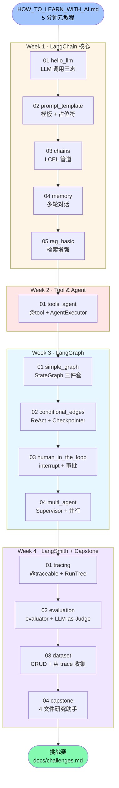

# Tutorial — 学习剧本

每篇 tutorial 是一份带任务卡 + 给 AI 的 prompt 的"学习剧本"。

**这不是文档，是脚手架**——你不读完它就懂，你按它跟 AI 对话产出代码，最后回头对比 `final/` 看自己写得怎样。

---

## 学习路线（4 周 14 篇）

| 周次 | 目录 | 概念 | 状态 |
|------|------|------|------|
| Week 1 | [week-1-langchain/](week-1-langchain/) | LangChain 核心：LLM、Prompt、LCEL、Memory、RAG | ✅ 5/5 |
| Week 2 | [week-2-tools-and-agent/](week-2-tools-and-agent/) | Tool & Agent | ✅ 1/1 |
| Week 3 | [week-3-langgraph/](week-3-langgraph/) | StateGraph、条件边、HITL、多 Agent | ✅ 4/4 |
| Week 4 | [week-4-langsmith-and-project/](week-4-langsmith-and-project/) | 追踪、评估、综合项目 | ✅ 4/4 |

---

## 学习路径图（依赖关系）

> mermaid 图在 GitHub repo 浏览 / GitHub Pages 都能直接渲染。本地预览用 VS Code 装 "Markdown Preview Mermaid Support" 插件。

---

## 前置概念依赖

走每一篇前需要懂的"前置概念"——讲不出 = 回去补：

| Tutorial | 必须懂 |
|---|---|
| **week-1/01_hello_llm** | LLM 是补全器 / token 计费 / Chat 三种角色（→ [docs/concepts.md](../docs/concepts.md)） |
| **week-1/02_prompt_template** | 01 内容 + Python f-string |
| **week-1/03_chains** | 02 内容 + Unix 管道（`cat \| grep`）的概念 |
| **week-1/04_memory** | 03 内容 + dict / list 操作 |
| **week-1/05_rag_basic** | 04 内容 + Embedding 是什么 |
| **week-2/01_tools_agent** | week-1 全部 + Python 装饰器（`@xxx`） |
| **week-3/01_simple_graph** | week-2 + TypedDict + 流程图概念 |
| **week-3/02_conditional_edges** | 01 + ReAct 循环 |
| **week-3/03_human_in_the_loop** | 02 + Checkpointer / thread_id |
| **week-3/04_multi_agent** | 03 + Supervisor 模式日常类比（PM + 专家团） |
| **week-4/01_tracing** | week-3 + 黑匣子录像类比 |
| **week-4/02_evaluation** | 01 + dataset 概念 |
| **week-4/03_dataset** | 02 + CRUD 概念 |
| **week-4/04_capstone** | 全部 13 篇 + 项目分模块的工程感 |

---

## 走法

1. 每周从最小编号开始（01_xxx.md）
2. 按"准备 → 任务卡 → 自检 → 卡点日志"顺序走
3. 卡 5 分钟以上 → 发 AI："给我一个再小一号的练习"
4. 通过自检 → 跳下一篇；不通过 → 留尾巴下次问，先继续

---

## 第一次跑这套？

按顺序走 4 步：

1. [HOW_TO_LEARN_WITH_AI.md](../HOW_TO_LEARN_WITH_AI.md) — 元教程，5 分钟
2. [SETUP.md](../SETUP.md) — 环境配置，~15 分钟
3. [docs/concepts.md](../docs/concepts.md) — 18 个核心术语提前扫一遍（不用记，知道有这页能查就行）
4. 回来这里 → 开始 [week-1-langchain/01_hello_llm.md](week-1-langchain/01_hello_llm.md)

走完 4 周 → 挑一个 [docs/challenges.md](../docs/challenges.md) 做出师作业。
